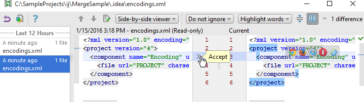
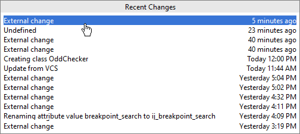

# Using Local History

**Local history** is a feature built into PyCharm that allows you to chronologically view changes to a file, diff changes to files as you're working on them, and revert changes, all without using a version control system.

You can think of local history as your own personal version control system (VCS) inside of PyCharm. Local history doesn't depend on any external VCS like Subversion, Mercurial, or Git. This means local history will work with files that aren't being tracked by your VCS and doesn't require commits to a repository.

Local history will persist until you install a new version of PyCharm or [invalidate PyCharm's caches](https://www.jetbrains.com/help/pycharm/cleaning-system-cache.html). If you need to keep track of the changes you've made, be sure you commit your files and changes to your VCS before updating PyCharm or clearing caches.

## Viewing Local History of Source Code

### Basics

Besides file history, you can track local changes for a selected block of source code. his history shows only those changes that affect the code fragment.

### Viewing local history of a source code block

To view local history of a source code block

1. In the editor, select a fragment of source code.
2. Do one of the following:
    * On the main VCS menu, or on the context menu of the selection, choose **Local History | Show History for Selection**.
    * Press `Alt+Back Quote`, and choose the desired command from the VCS Operations quick list.

## Viewing Local History of a File or Folder

### Basics

Local History makes it possible to view changes made to a certain file or a whole directory. Each entry in the Local History dialog box is displayed with its time stamp, action and optional label. So doing, the local history for a file includes all changes that affect both the selected file and the whole project; local history for a folder shows changes to the source code tree in general. You can explore changes, selecting the respective row in the Local History dialog box.

### Viewing local history

To view local history

1. Select a folder or file in the Project tool window, or open a file in the editor.
2. Do one of the following:
    * On the main VCS menu, or on the context menu of the selection, choose **Local History | Show History**.
    * Press `Alt+Back Quote`, and choose the desired command from the VCS Operations quick list.
    * Use [View Recent Changes]() that shows a summary of recent changes in a single pop-up list. Clicking an entry in this list shows the respective Local History.
3. Use the Local History view to compare local versions and revert changes.
    

## Viewing Recent Changes

### Basics

PyCharm allows you to view the summary of recent changes to all recent projects, the PyCharm configuration directory, etc. From the Recent Changes pop-up, you can browse through the history of changes, navigate to a particular change, compare versions, and revert changes if necessary

### Viewing recent changes

1. From the main menu, choose **View | Recent Changes**, or press `Shift+Alt+C`.
2. In the **Recent Changes** pop-up, select the change you are interested in:
    
3. In the dialog that opens, review the differences and discard changes if necessary.

## Restoring a File from Local History

Rolling back changes from the local history works same way as in the regular version control.

To roll back changes in the local history

1. Open the Local History view.
2. Select the version you want to roll back to.
3. On the context menu of the selection, choose Revert.

## Putting Labels

### Introduction

Before embarking on a risky change to your source code, it is a good idea to mark the stable version with some meaningful label. This will help you quickly roll back to a safe version.

Labels apply to a whole project.

### Adding a label to a local version

To add a label to a local version

1. Select a file or folder in the Project tool window, or open a file in the editor.
2. Do one of the following:
3. On the main VCS menu, or on the context menu of the selection, choose **Local History | Put Label**.
4. Press `Alt+Back Quote` and choose **Put Label** command from the VCS Operations quick list.
5. In the Put Label dialog box, type the label name.